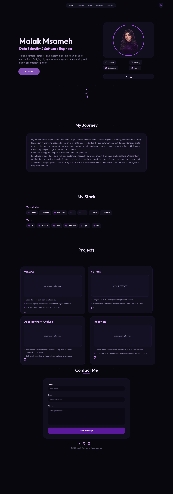
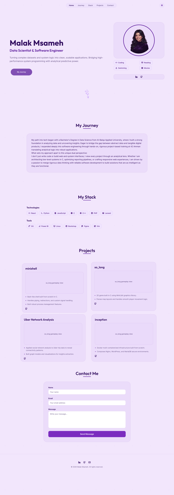
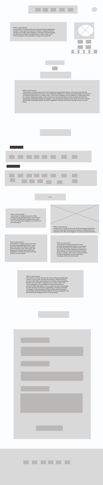

# Personal-Portfolio
# 💜 Malak Msameh — Personal Portfolio

> A personal portfolio website designed and developed with Semantic HTML5 and CSS3 to showcase my background, technical skills, software engineering projects, and data science work.

---

## 🔗 Live Link

**Live Demo:**
https://malakmsameh.github.io/Personal-Portfolio/

### - used github pages to deploy my protfolio
---

## 📌 About the Project

This project is a personal portfolio website created to present my professional background, technical skills, software engineering projects, and selected data science work in a simple and modern interface.

The website was designed in **Figma** first and then implemented using **HTML5 and CSS3**.

The portfolio includes:

- A landing / hero section
- A personal journey and background section
- A technical stack section
- A projects showcase
- Social and contact links
- Light and dark themes
- Responsive layouts for different screen sizes
- CSS animations, hover effects, and smooth scrolling

The project focuses on keeping the implementation lightweight and using native HTML and CSS features rather than JavaScript frameworks.

---

## ✨ Features

### 🏠 Hero Section

- Personal introduction
- Professional title
- Short professional statement
- Profile image
- Hobbies
- Social media links
- Animated "Explore my Journey" scroll indicator

### 🧭 My Journey

A short overview of my background in:

- Data Science
- Software Engineering
- Data Analytics
- SQL and Python
- C/C++ system programming

### 🛠️ Technical Stack

The portfolio presents technologies and tools across different categories, including:

**Languages & Development**
- Python
- JavaScript
- C
- C++
- PHP
- Laravel
- React

**Tools**
- Git
- GitHub
- Linux
- Ubuntu
- Zsh
- Vim
- Power BI
- Excel
- PowerPoint
- Figma
- Bootstrap

### 💻 Projects

The portfolio currently showcases five projects:

#### 1. minishell

A Bash-like Unix shell implemented from scratch in C.

- Process creation and execution
- Pipes and redirections
- Signal handling
- Environment management

#### 2. so_long

A 2D game developed in C using the MiniLibX graphics library.

- Map parsing
- Player movement
- Game logic
- 2D graphical rendering

#### 3. inception

A containerized infrastructure project built using Docker.

- Multi-container architecture
- Nginx
- WordPress
- MariaDB
- Containerized services

#### 4. Uber Network Analysis

A data science project applying social network analysis techniques to Uber trip data.

- Graph-based data modeling
- Network connectivity analysis
- Pattern identification
- Data visualization

#### 5. Email Spam Classifier & Dashboard

A Python-based text classification project combined with analytical reporting.

- Spam classification
- Text processing
- Machine learning
- Power BI dashboard metrics

---

## 🎨 Design

The website was designed in **Figma** before development.

The design includes:

- 🌙 Dark mode
- ☀️ Light mode
- 📐 Wireframe planning
- Responsive layout planning
- Card-based content sections
- Purple / lavender visual theme

### Figma Exports

#### 🌙 Dark Mode



#### ☀️ Light Mode



#### 📐 Wireframe



---

## 📁 Project Structure

```text
personal_portfolio/
│
├── README.md
├── index.html
├── style.css
│
├── figma/
│   ├── mock/
│   │   ├── portfolio_dark.png
│   │   └── protfolio_light.png
│   │
│   └── wirefram/
│       └── Wireframe.png
│
└── images/
    └── avatar.jpg
```

---

## 🧰 Technologies Used

| Technology | Purpose |
|------------|---------|
| HTML5 | Semantic website structure |
| CSS3 | Styling, layout, themes, animations, and responsiveness |
| CSS Grid | Page and project layouts |
| CSS Flexbox | Navigation, badges, social links, and component alignment |
| CSS Variables | Theme colors and reusable styling values |
| CSS `:has()` | CSS-only light/dark mode switching |
| CSS `@keyframes` | Animated scroll indicator |
| Font Awesome | Icons for social links and technologies |
| Figma | UI design and wireframe creation |
| Git | Version control |
| GitHub | Repository hosting |

---

## 🌗 Light & Dark Mode

The portfolio includes a CSS-only theme switcher.

The theme is implemented using:

- CSS custom properties
- A hidden checkbox
- The CSS `:checked` state
- The `:has()` selector

No JavaScript is required for switching between the two themes.

---

## 📱 Responsive Design

The website is designed to adapt to:

- 📱 Mobile screens
- 📲 Tablet screens
- 💻 Desktop screens

Responsive behavior is achieved primarily through:

- CSS Grid
- Flexbox
- Flexible widths
- `clamp()`
- Responsive sizing
- Flexible spacing
- Wrapping layouts

The goal is to keep the layout usable and readable across different viewport sizes.

---

# 🚀 How to Use

There are two ways to view the portfolio.

---

## 👤 Option 1 — Simple User

If you only want to view the website, you do not need to install anything.

### Step 1 — Open the Live Link

Go to:

### https://malakmsameh.github.io/Personal-Portfolio/**

### Step 2 — Explore the Website

You can:

- Browse the different sections
- View the projects
- Explore the technical stack
- Switch between light and dark mode
- Open the social media links
- View the Figma design previews

No installation or programming knowledge is required.

---

# 👨‍💻 Option 2 — Developer

If you want to download, inspect, modify, or run the project locally, follow the steps below.

## 1. Clone the Repository

Open your terminal and run:

```bash
git clone git@github.com:malakmsameh/Personal-Portfolio.git
```

---

## 2. Enter the Project Directory

```bash
cd Personal-Portfolio
```

---

## 3. Check the Project Files

You should see a structure similar to:

```text
README.md
index.html
style.css
figma/
images/
```

---

## 4. Run with VS Code Live Server

### Recommended Method

1. Open the project in Visual Studio Code:

```bash
code .
```

2. Install the **Live Server** extension if it is not already installed.

3. Open `index.html`.

4. Right-click anywhere inside the HTML file.

5. Select:

```text
Open with Live Server
```

6. The portfolio will open automatically in your browser.

---

## 5. Run Using a Local Python Server

If Python is installed, you can also run the website using Python's built-in HTTP server.

From the project directory:

```bash
python3 -m http.server 8000
```

Then open:

```text
http://localhost:8000
```
The portfolio should now be available locally.
---

# 🧑‍💻 Development

This project uses a simple front-end structure without a JavaScript framework.

The main files are:

### `index.html`

Contains the semantic HTML structure of the portfolio, including:

- Navigation
- Hero section
- Journey section
- Technical stack
- Projects
- Footer and social links

### `style.css`

Contains:

- Theme variables
- Light/dark mode styling
- Layout
- Grid and Flexbox rules
- Typography
- Cards
- Hover effects
- Animations
- Responsive behavior

### `images/`


### `figma/`

Contains the exported design references:

- Dark mode mockup
- Light mode mockup
- Wireframe

---

# 🎯 Project Goals

The main goals of this project were to:

- Practice semantic HTML5
- Build layouts using CSS Grid and Flexbox
- Create a responsive website
- Practice modern CSS techniques
- Implement a light/dark theme without JavaScript
- Apply hover effects and animations
- Organize a front-end project using Git and GitHub
- Translate a Figma design into a functional website
- Create a professional online portfolio

---

# 📚 What This Project Demonstrates

This portfolio demonstrates practical experience with:

- Semantic HTML
- Modern CSS
- Responsive web design
- CSS Grid
- CSS Flexbox
- CSS custom properties
- CSS selectors
- CSS animations
- UI implementation from Figma
- Git and GitHub
- Basic front-end project organization

It also provides an overview of my broader technical interests and projects in:

- Data Science
- Data Analytics
- Software Engineering
- Systems Programming
- Machine Learning

---

# 📬 Contact

If you would like to connect or discuss an opportunity, you can reach me through:

- **LinkedIn:** [linkedin.com/in/malak-msameh](https://www.linkedin.com/in/malak-msameh/)
- **GitHub:** [github.com/malakmsameh](https://github.com/malakmsameh)
- **Email:** [malak.musameh31@gmail.com](mailto:malak.musameh31@gmail.com)

---

# 📄 License

© 2026 Malak Msameh. All rights reserved.

This repository is intended for personal portfolio and demonstration purposes.